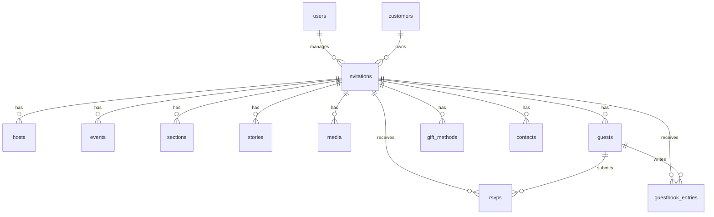

# JALL Invitation — Database Design

> **Versi:** 1.0.0-draft
> **Tanggal:** 2026-08-03

---

## 1. Entity Relationship Diagram

---

## 2. Tabel Detail

### 2.1 `users` (Admin)

Tabel bawaan Laravel, diperluas untuk admin panel.

| Kolom | Tipe | Keterangan |
|-------|------|------------|
| id | BIGINT UNSIGNED PK | Auto increment |
| name | VARCHAR(255) | Nama admin |
| email | VARCHAR(255) UNIQUE | Email login |
| email_verified_at | TIMESTAMP NULL | — |
| password | VARCHAR(255) | Hashed password |
| role | VARCHAR(50) DEFAULT 'admin' | 'super_admin', 'admin' |
| is_active | BOOLEAN DEFAULT true | Status aktif |
| remember_token | VARCHAR(100) NULL | — |
| created_at | TIMESTAMP | — |
| updated_at | TIMESTAMP | — |

---

### 2.2 `customers`

| Kolom | Tipe | Keterangan |
|-------|------|------------|
| id | BIGINT UNSIGNED PK | Auto increment |
| name | VARCHAR(255) | Nama pelanggan |
| phone | VARCHAR(50) NULL | Nomor WhatsApp |
| email | VARCHAR(255) NULL | Email (opsional) |
| address | TEXT NULL | Alamat (opsional) |
| notes | TEXT NULL | Catatan internal admin |
| created_at | TIMESTAMP | — |
| updated_at | TIMESTAMP | — |
| deleted_at | TIMESTAMP NULL | Soft delete |

**Indeks:** `phone`, `email`

---

### 2.3 `invitations`

| Kolom | Tipe | Keterangan |
|-------|------|------------|
| id | BIGINT UNSIGNED PK | Auto increment |
| customer_id | FK → customers | Pemilik undangan |
| user_id | FK → users NULL | Admin yang menangani |
| slug | VARCHAR(255) UNIQUE | URL slug publik |
| title | VARCHAR(255) | Judul undangan |
| event_type | VARCHAR(50) | 'wedding', 'engagement', 'birthday', 'aqiqah', 'graduation', 'general' |
| template_id | VARCHAR(100) | ID template dari manifest |
| template_version | VARCHAR(20) NULL | Versi template saat publish |
| status | VARCHAR(50) DEFAULT 'draft' | 'draft', 'preview', 'published', 'expired', 'archived' |
| settings_json | JSON NULL | Override tema template |
| opening_text | TEXT NULL | Teks pembuka / bismillah |
| closing_message | TEXT NULL | Pesan penutup |
| music_path | VARCHAR(500) NULL | Path file musik |
| music_autoplay | BOOLEAN DEFAULT true | Autoplay setelah buka |
| livestream_url | VARCHAR(500) NULL | URL livestream |
| livestream_label | VARCHAR(255) NULL | Label tombol livestream |
| share_message | TEXT NULL | Template pesan WhatsApp |
| published_at | TIMESTAMP NULL | Tanggal publish |
| expires_at | TIMESTAMP NULL | Tanggal kadaluarsa |
| created_at | TIMESTAMP | — |
| updated_at | TIMESTAMP | — |
| deleted_at | TIMESTAMP NULL | Soft delete |

**Indeks:** `slug` (unique), `customer_id`, `status`, `template_id`, `expires_at`

---

### 2.4 `hosts`

Pasangan, keluarga, atau tuan rumah acara.

| Kolom | Tipe | Keterangan |
|-------|------|------------|
| id | BIGINT UNSIGNED PK | — |
| invitation_id | FK → invitations | — |
| role | VARCHAR(50) | 'groom', 'bride', 'celebrant', 'child', 'host' |
| name | VARCHAR(255) | Nama lengkap |
| nickname | VARCHAR(100) NULL | Nama panggilan |
| photo_path | VARCHAR(500) NULL | Foto profil |
| bio | TEXT NULL | Profil singkat |
| birth_order | VARCHAR(100) NULL | "Putra pertama dari" dsb |
| parent_father | VARCHAR(255) NULL | Nama ayah |
| parent_mother | VARCHAR(255) NULL | Nama ibu |
| social_instagram | VARCHAR(255) NULL | Username Instagram |
| social_tiktok | VARCHAR(255) NULL | Username TikTok |
| position | INTEGER DEFAULT 0 | Urutan tampilan |
| created_at | TIMESTAMP | — |
| updated_at | TIMESTAMP | — |

**Indeks:** `invitation_id`, `position`

---

### 2.5 `events`

Jadwal acara (akad, resepsi, pesta, dll).

| Kolom | Tipe | Keterangan |
|-------|------|------------|
| id | BIGINT UNSIGNED PK | — |
| invitation_id | FK → invitations | — |
| label | VARCHAR(255) | "Akad Nikah", "Resepsi", dll |
| date | DATE | Tanggal acara |
| start_time | TIME NULL | Jam mulai |
| end_time | TIME NULL | Jam selesai ("Selesai" jika null) |
| timezone | VARCHAR(50) DEFAULT 'Asia/Jakarta' | Timezone |
| venue_name | VARCHAR(255) NULL | Nama gedung/tempat |
| address | TEXT NULL | Alamat lengkap |
| map_url | VARCHAR(500) NULL | URL Google Maps / embed |
| latitude | DECIMAL(10,8) NULL | Koordinat lat |
| longitude | DECIMAL(11,8) NULL | Koordinat lng |
| parking_notes | TEXT NULL | Petunjuk parkir |
| entrance_notes | TEXT NULL | Petunjuk masuk |
| landmark_notes | TEXT NULL | Landmark terdekat |
| dress_code | VARCHAR(255) NULL | Dress code (opsional) |
| is_primary | BOOLEAN DEFAULT false | Acara utama untuk countdown |
| position | INTEGER DEFAULT 0 | Urutan tampilan |
| created_at | TIMESTAMP | — |
| updated_at | TIMESTAMP | — |

**Indeks:** `invitation_id`, `date`, `is_primary`

---

### 2.6 `sections`

Konfigurasi visibility dan urutan section per undangan.

| Kolom | Tipe | Keterangan |
|-------|------|------------|
| id | BIGINT UNSIGNED PK | — |
| invitation_id | FK → invitations | — |
| key | VARCHAR(100) | 'opening', 'hosts', 'events', 'countdown', 'calendar', 'map', 'story', 'gallery', 'rsvp', 'guestbook', 'gifts', 'contacts', 'livestream', 'sharing', 'closing' |
| enabled | BOOLEAN DEFAULT true | Tampilkan section? |
| position | INTEGER DEFAULT 0 | Urutan tampilan |
| content_json | JSON NULL | Override konten khusus section |
| created_at | TIMESTAMP | — |
| updated_at | TIMESTAMP | — |

**Indeks:** `invitation_id`, `key` (composite unique: invitation_id + key)

---

### 2.7 `stories`

Love story / timeline entries.

| Kolom | Tipe | Keterangan |
|-------|------|------------|
| id | BIGINT UNSIGNED PK | — |
| invitation_id | FK → invitations | — |
| date | VARCHAR(100) NULL | Tanggal / tahun (free text: "2020", "Januari 2022") |
| title | VARCHAR(255) | Judul cerita |
| body | TEXT NULL | Deskripsi |
| image_path | VARCHAR(500) NULL | Foto |
| position | INTEGER DEFAULT 0 | Urutan |
| created_at | TIMESTAMP | — |
| updated_at | TIMESTAMP | — |

**Indeks:** `invitation_id`, `position`

---

### 2.8 `media`

Galeri foto, video, dan file media lainnya.

| Kolom | Tipe | Keterangan |
|-------|------|------------|
| id | BIGINT UNSIGNED PK | — |
| invitation_id | FK → invitations | — |
| type | VARCHAR(50) | 'photo', 'video', 'audio' |
| path | VARCHAR(500) | Path file atau URL (untuk video embed) |
| thumbnail_path | VARCHAR(500) NULL | Thumbnail untuk foto/video |
| alt_text | VARCHAR(255) NULL | Teks alternatif |
| caption | VARCHAR(500) NULL | Caption |
| position | INTEGER DEFAULT 0 | Urutan |
| created_at | TIMESTAMP | — |
| updated_at | TIMESTAMP | — |

**Indeks:** `invitation_id`, `type`, `position`

---

### 2.9 `guests`

Daftar tamu undangan.

| Kolom | Tipe | Keterangan |
|-------|------|------------|
| id | BIGINT UNSIGNED PK | — |
| invitation_id | FK → invitations | — |
| token | VARCHAR(100) UNIQUE | Opaque token untuk link personal |
| display_name | VARCHAR(255) | Nama tampilan tamu |
| group | VARCHAR(255) NULL | Grup/kategori (keluarga, kantor, dll) |
| phone | VARCHAR(50) NULL | Nomor WA tamu |
| invitation_limit | INTEGER DEFAULT 2 | Batas jumlah orang |
| has_attended | BOOLEAN NULL | Tracking kehadiran |
| link_opened_at | TIMESTAMP NULL | Kapan link dibuka |
| created_at | TIMESTAMP | — |
| updated_at | TIMESTAMP | — |

**Indeks:** `invitation_id`, `token` (unique), `group`

---

### 2.10 `rsvps`

Respons kehadiran tamu.

| Kolom | Tipe | Keterangan |
|-------|------|------------|
| id | BIGINT UNSIGNED PK | — |
| invitation_id | FK → invitations | — |
| guest_id | FK → guests NULL | Null jika dari link tanpa token |
| name | VARCHAR(255) | Nama pengisi RSVP |
| status | VARCHAR(50) | 'attending', 'not_attending', 'tentative' |
| party_size | INTEGER DEFAULT 1 | Jumlah orang |
| note | TEXT NULL | Catatan |
| ip_address | VARCHAR(45) NULL | Untuk rate limiting |
| submitted_at | TIMESTAMP | Waktu submit |
| created_at | TIMESTAMP | — |
| updated_at | TIMESTAMP | — |

**Indeks:** `invitation_id`, `guest_id`, `status`

---

### 2.11 `guestbook_entries`

Buku ucapan / wishes.

| Kolom | Tipe | Keterangan |
|-------|------|------------|
| id | BIGINT UNSIGNED PK | — |
| invitation_id | FK → invitations | — |
| guest_id | FK → guests NULL | Null jika anonim |
| name | VARCHAR(255) | Nama pengirim |
| message | TEXT | Pesan ucapan |
| moderation_status | VARCHAR(50) DEFAULT 'pending' | 'pending', 'approved', 'rejected' |
| ip_address | VARCHAR(45) NULL | Untuk rate limiting |
| created_at | TIMESTAMP | — |
| updated_at | TIMESTAMP | — |

**Indeks:** `invitation_id`, `moderation_status`

---

### 2.12 `gift_methods`

Metode hadiah / amplop digital.

| Kolom | Tipe | Keterangan |
|-------|------|------------|
| id | BIGINT UNSIGNED PK | — |
| invitation_id | FK → invitations | — |
| type | VARCHAR(50) | 'bank_transfer', 'ewallet', 'physical_gift' |
| provider | VARCHAR(100) NULL | "BCA", "Mandiri", "GoPay", "OVO", dll |
| account_name | VARCHAR(255) NULL | Nama pemilik rekening |
| account_number | VARCHAR(255) NULL | Nomor rekening (pertimbangkan enkripsi) |
| delivery_address | TEXT NULL | Alamat pengiriman hadiah fisik |
| notes | TEXT NULL | Catatan tambahan |
| position | INTEGER DEFAULT 0 | Urutan |
| created_at | TIMESTAMP | — |
| updated_at | TIMESTAMP | — |

**Indeks:** `invitation_id`, `position`

---

### 2.13 `contacts`

Kontak keluarga / penyelenggara.

| Kolom | Tipe | Keterangan |
|-------|------|------------|
| id | BIGINT UNSIGNED PK | — |
| invitation_id | FK → invitations | — |
| label | VARCHAR(255) | "Keluarga Mempelai Pria", dll |
| name | VARCHAR(255) | Nama kontak |
| phone | VARCHAR(50) NULL | Nomor telepon/WA |
| position | INTEGER DEFAULT 0 | Urutan |
| created_at | TIMESTAMP | — |
| updated_at | TIMESTAMP | — |

**Indeks:** `invitation_id`, `position`

---

## 3. Relasi Antar Tabel

| Parent | Child | Relasi | On Delete |
|--------|-------|--------|-----------|
| customers | invitations | 1:N | RESTRICT |
| users | invitations | 1:N (nullable) | SET NULL |
| invitations | hosts | 1:N | CASCADE |
| invitations | events | 1:N | CASCADE |
| invitations | sections | 1:N | CASCADE |
| invitations | stories | 1:N | CASCADE |
| invitations | media | 1:N | CASCADE |
| invitations | guests | 1:N | CASCADE |
| invitations | rsvps | 1:N | CASCADE |
| invitations | guestbook_entries | 1:N | CASCADE |
| invitations | gift_methods | 1:N | CASCADE |
| invitations | contacts | 1:N | CASCADE |
| guests | rsvps | 1:N (nullable FK) | SET NULL |
| guests | guestbook_entries | 1:N (nullable FK) | SET NULL |

---

## 4. Penggunaan JSON

JSON hanya digunakan untuk:
- `invitations.settings_json` — Override tema template (warna, font, animasi) yang sesuai schema manifest.
- `sections.content_json` — Override konten khusus section yang tidak terstruktur.

Data yang queryable dan transaksional (RSVP, guests, events, dll) tetap di tabel relasional.

---

## 5. Soft Delete

Soft delete diterapkan pada:
- `customers` — Pelanggan bisa di-restore.
- `invitations` — Undangan yang diarsipkan tetap tersimpan.

Tabel child (hosts, events, guests, dll) menggunakan cascade delete dari invitation parent.

---

## 6. Catatan Keamanan Database

- `guests.token` menggunakan opaque string (UUID v4 atau `Str::random(32)`), bukan auto-increment ID.
- `gift_methods.account_number` sebaiknya di-encrypt menggunakan Laravel's `Crypt` facade jika diperlukan.
- Indeks pada kolom yang sering di-query dan di-filter.
- Composite unique constraint pada `sections` (invitation_id + key) untuk mencegah duplikasi.
